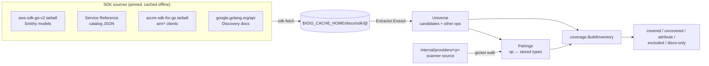
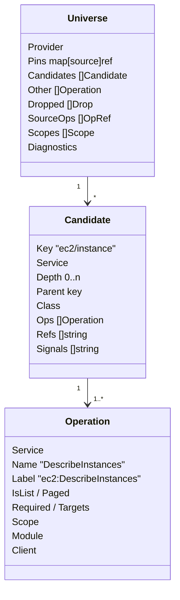
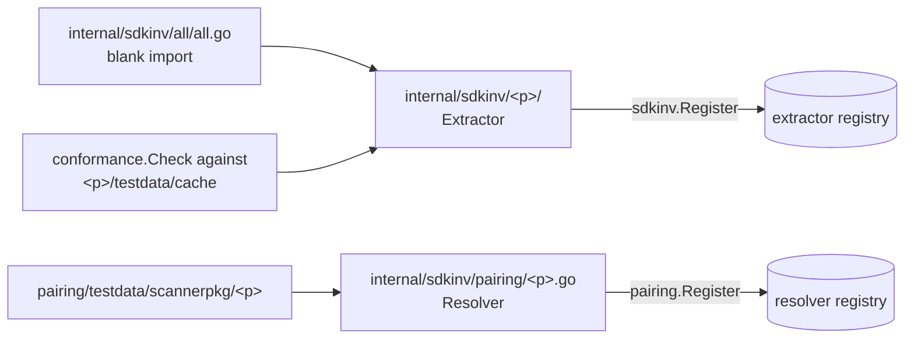
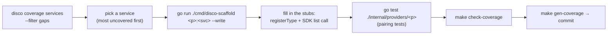

# `internal/sdkinv` — the SDK-derived coverage inventory

`sdkinv` answers one question without a hand-maintained list: **of every resource a cloud's own
SDK can list, which ones do disco's scanners actually list?** It reads the providers' SDK sources
(not the live clouds), derives the set of listable resources, statically reads disco's scanner
source to see which SDK calls each scanner makes, and pairs the two. Everything downstream —
`disco coverage services`, the per-service percentages in `docs/coverage.md`, the CI ratchet,
`disco-scaffold`, `coverage resolvers --missing`, `coverage verify` — is computed from that pairing.



Nothing in this package imports `internal/providers` or `internal/coverage`. The package is pure
data plus filesystem; the cloud SDKs are never linked, so every build tag and slim build can run
it.

## Package layout

| Path | Role |
|---|---|
| `sdkinv.go` | Shared types (`Candidate`, `Operation`, `Universe`), the `Extractor` interface and its registry |
| `cache.go`, `fetch.go` | Cache directory resolution, manifest, streaming tar/zip extraction with path filters, JSON-index fetch |
| `pins.go` | The pinned refs (`AWSSDKRef`, `AzureSDKRef`, `GCPAPIRef`); a pin bump changes the denominator |
| `norm.go` | `Ident` (identity), `Singular` (display), `Canon`, `SortOps` |
| `pathtmpl.go` | REST path-template parser shared by Azure and GCP: `{param}` segments, scope stripping, depth |
| `aws/`, `azure/`, `gcp/` | One extractor per provider: `<p>.go` (fetch spec, registration), `extract.go` (rules), `refs.go` (reference fields) |
| `<p>/testdata/cache/` | A synthetic mini-SDK per provider; the conformance suite and unit tests run against it |
| `conformance/` | The contract every extractor's fixture must satisfy |
| `pairing/` | The `go/ast` walker, the `Resolver` interface and one resolver per provider (`aws.go`, `azure.go`, `gcp.go`) |
| `pairing/testdata/scannerpkg/<p>/` | A synthetic scanner package parsed (never compiled) against the fixture cache |
| `all/` | Blank imports that register the three extractors; `TestAllExtractorsConform` lives here |

## The data model



A **candidate** is one SDK-listable thing; it is the unit of the denominator. One candidate may
carry several operations (`DescribeDBInstances` and `ListTagsForResource` both land on
`rds/dbinstance`); one operation may store several disco types. Coverage counts candidates, never
types or ops.

| Field | Meaning | Example |
|---|---|---|
| `Key` | `<service>/<resource path>` in the provider's own spelling, singular | `kms/grant`, `microsoft.compute/virtualmachines/extensions`, `run/projects.locations.jobs.executions` |
| `Depth` / `Parent` | How many parent ids the listing needs; `Parent` is the parent candidate's key | `s3/object` depth 1, parent `s3/bucket` |
| `Class` | What kind of thing the listing returns (table below) | |
| `Ops` | Every SDK operation that lists or reads it, with the disco **op label** the scanner would use | `ec2:DescribeInstances` |
| `Refs` | Field paths on the listed element that name *other* resources; the hints `resolvers --missing` shows | `VpcId`, `SubnetIds`, `properties.networkProfile.networkInterfaces` |
| `Signals` | Audit trail of the rules that fired, so a surprising row can be explained without a debugger | `sr:IsList`, `shape-list`, `child-uncatalogued` |

| Class | Rule of thumb | Counted in % | Examples |
|---|---|---|---|
| `resource` | Listable and persistent; something can be created or deleted | yes | `ec2/instance`, `kms/grant` |
| `attribute` | A `Get` of one parent's setting, no collection | no (listed) | `iam/accountpasswordpolicy`, `s3/bucket/bucketencryption` |
| `catalog` | Provider-published, read-only | no | `ec2/instancetype`, `compute/zones`, `microsoft.servicefabric/managedclusterversions` |
| `non-resource` | Operations, metrics, history, account attributes | no | `iam/accountsummary`, `*/operations` |

`Universe.Other` holds every SDK operation that is **not** a candidate op (writes, item reads,
actions). Pairing needs it: a scanner that builds a type from a `Get` pairs with an `other` op and
is *explained*, not *unexplained*.

## The cache and the pins

```
$XDG_CACHE_HOME/disco/sdk/
├── aws@release-2026-09-15/
│   ├── manifest.json                       written last; no manifest = absent
│   ├── repo/codegen/sdk-codegen/aws-models/*.json   431 Smithy models
│   └── service-reference/{index.json,<service>.json}   456 catalog docs
├── azure@<commit sha>/repo/sdk/resourcemanager/<rp>/arm<rp>/{*_client.go,models.go,...}
└── gcp@v0.292.0/api/<api>/<ver>/<api>-api.json     654 Discovery docs
```

| Command | Effect |
|---|---|
| `disco coverage sdk fetch` / `make sdk-fetch` | Populate the cache at the pinned refs (≈26 s, ≈435 MB); a rerun is a no-op, `--force` refetches |
| `disco coverage sdk status` | Print each provider's ref, presence and path |
| `disco coverage services` | Extract + pair + report; exit 2 with a hint when the cache is absent |

Pins are the denominator's version. `AWSSDKRef` and `AzureSDKRef` live in `pins.go`; the GCP
version is read from `debug.ReadBuildInfo()` (`GCPAPIRef` is the fallback and `TestPinMatchesGoMod`
keeps it equal to `go.mod`). The AWS Service Reference catalog is unversioned, so its pin is the
newest `modified` stamp in its index. Every report prints the pins; numbers are only comparable
across identical pins.

## Extraction, per provider

Each extractor turns its SDK's own description of the API into candidates. The rules are
provider-specific because the SDKs are; everything after extraction is shared.

| | AWS (`aws/extract.go`) | Azure (`azure/extract.go`) | GCP (`gcp/extract.go`) |
|---|---|---|---|
| Source of truth | Smithy model per service + Service Reference catalog (per-action `IsList`/`IsWrite`, target resources, ARN formats) | `urlPath := "..."` literals in generated `*_client.go` request builders | Discovery `*-api.json`: `methods`, `flatPath`/`path`, `parameters[].pattern`, `schemas` |
| Service join key | `aws.auth#sigv4.name` == Service Reference name | ARM namespace after the last `providers/` segment | Discovery API name |
| What is a lister | `IsList` from the catalog, or a List/Describe with a collection output that no `IsWrite` action claims | any `http.MethodGet` builder whose stripped path does not end in a `{param}` (the paged `Value []*T` shape is typical, not required: ~307 singleton/action GETs come in this way and all land in `excluded`) | Method key `list` or `aggregatedList` |
| Key | `<service>/<noun>` where noun = op name minus verb, identity-folded | namespace + static path segments after scope pairs are stripped | `<api>/<collection path>`, lower-cased |
| Depth / parent | Target resources from the catalog, then the subject's own ARN variables, then required id-shaped inputs | `{param}` segments between statics | `{param}` segments between statics; `{+parent}` expanded from the pattern |
| Class | Catalog resource with an ARN → resource; child with ids → resource; `Get` without collection → attribute; noun with a non-tagging write → resource; else catalog | Item path has PUT/PATCH/DELETE → resource; GET only → catalog; no item path → non-resource | `insert`/`create` or `delete` → resource; `get` only → catalog; else non-resource |
| Scope params (never a parent) | `AccountId`, `Region`, paging members | `subscriptions/{}`, `resourceGroups/{}`, `locations/{}`, `managementGroups/{}`; `{scope}` first → `extension` | `projects/{}`, `organizations/{}`, `folders/{}`, `billingAccounts/{}`; `locations/zones/regions/{}` |
| Universe filter | Every service with a Smithy model | Everything under `sdk/resourcemanager` | APIs where some lister's root is a cloud root (192 of 654 docs) |
| Refs | Output element members matching `idLikeRe`, own id excluded | `*SubResource`/`*Reference` structs and `*ID` strings on the `Value` element | `*Link/*Url/*Id/*Ref/...` string properties or URL/resource-name descriptions |

Live sizes at the 2026-09 pins: AWS 5561 candidates / 354 services (3250 resources); Azure 3744
(1959 resources); GCP 1859 / 192 APIs (1151 resources). The live tests log these; a large swing
after a pin bump is the signal to re-check anchors.

### Identity versus display

Two spellings of one thing must merge, and the merged key must still read well:

| Function | Purpose | `Aliases` | `Analyses` | `Statuses` |
|---|---|---|---|---|
| `Ident` | The **only** equality used across sources (extractor merge, name matching, GCP registry keys) | `alia` | `analysi` | `statu` |
| `Singular` | Display only; never compared | `alias` | `analysis` | `status` |

Never show an `Ident`; never compare a `Singular`. There is no inflector dependency — each rule
in `norm.go` has a `norm_test` pair and exists because a real SDK noun needed it.

## Pairing: what each scanner actually lists

`pairing.Walk` parses every non-test `.go` file under `internal/providers/<p>` with the standard
`go/parser` (no `x/tools`) and finds, per function:

```mermaid
flowchart TD
    F["func scanKeys(...)"] --> A["anchor: kms.NewListKeysPaginator( → kms:ListKeys"]
    F --> L["label literal: \"kms:ListKeys\" (cross-check only)"]
    F --> T["types stored: TypeKMSKey via store.Resource{Type: ...}"]
    F --> C["callees to depth 3 + Type* args flowing in/out"]
    A & T & C --> P["Pairing{Op: kms:ListKeys, Types: [aws:kms:key], Kind: emits}"]
```

**Anchors are authoritative, labels are a cross-check.** An anchor is an SDK call shape the
provider's `Resolver` recognises (`pkg.New<Op>Paginator(`, `pkg.<Op>Input{`, `recv.<Op>(` for AWS;
`client.New<Op>Pager(` / `client.List*(` on a bound `arm*` client for Azure; `svc.A.B.List(` on a
bound Discovery service for GCP). A label literal (`skipIfAccessDenied(st, "kms:ListKeys", ...)`)
that names an op no anchor calls is a diagnostic, and the pairing tests fail on it.

| Pairing kind | Meaning | Covers the candidate? |
|---|---|---|
| `emits` | Anchor + the types the function (or its callees) stores | yes |
| `sidecar` | Anchor, no types: a listing helper; its direct caller is paired with what it stores | yes |
| `derived` | A dispatcher with no anchor of its own, paired with what its callees list | yes |
| `label` | A label literal with no call anywhere | no |
| `other` | A call to a non-candidate op (`Get`, writes) | no, but explains a type |
| `skew` | A call the pinned SDK snapshot does not ship | no; see the note below |

Every emitted type ends up in exactly one of: paired, or *unpaired* with a reason —
`non-sdk` (the file imports no SDK module: Entra over raw Graph HTTP), `other-op:<label>`,
`sdk-skew:<op>`, or `unexplained`. `unexplained` is the only fatal one: a type disco stores that no
SDK call in its file can produce. `--check-strict` and CI exit 1 on it.

## From pairing to a percentage

`internal/coverage.BuildInventory` (documented in `internal/coverage/CLAUDE.md`) joins the two:

| Bucket | Condition | In % |
|---|---|---|
| `covered` | Resource candidate with an `emits`/`sidecar`/`derived` pairing to one of its ops, or an emitted type whose `Ident` equals the candidate's (`matched-by-name`) | yes |
| `uncovered` | Resource candidate no scanner lists — **the only actionable gap** | yes |
| `attribute` / `excluded` | Attribute, catalog, non-resource, preview-only candidates | no |
| `disco-only` | Emitted type no candidate accounts for, with its unpaired reason | no |
| `registry-drift` | `--cross-check` only: the live registry and the SDK disagree | no |

`Percent = covered / (covered + uncovered)` per provider, per service and per depth, computed
before any `--filter`.

## Adding a provider

Everything below the extractor is provider-neutral: buckets, percentages, the baseline ratchet,
renderers, CI, `coverage verify`, `disco-scaffold` and the AST walker. A new provider (OCI, Alibaba,
DigitalOcean, Kubernetes, …) implements two interfaces and registers from `init()`.



1. **Extractor** (`internal/sdkinv/<p>/<p>.go` + `extract.go`), ~300–600 lines:

   ```go
   type extractor struct{}

   func (extractor) Name() string { return "oci" }
   func (extractor) Ref() string  { return sdkinv.OCISDKRef } // add the pin to pins.go
   func (extractor) FetchSpec() []sdkinv.FetchSource {
       return []sdkinv.FetchSource{{
           Name: "oci-go-sdk", Kind: sdkinv.KindTarball,
           URL:  "https://codeload.github.com/oracle/oci-go-sdk/tar.gz/" + sdkinv.OCISDKRef,
           Dest: "repo", Strip: 1,
           Keep: func(path string) bool { return strings.HasSuffix(path, "_client.go") },
       }}
   }
   func (extractor) Extract(ctx context.Context, dir string) (*sdkinv.Universe, error) {
       // read what the SDK ships, build candidates, then:
       //   sort candidates by Key, sort every slice built from a map (Signals, Refs, Ops)
       //   sdkinv.SortOps(u.Other)
       // account for every operation the sources declare, walked apart from classification:
       //   u.SourceOps (sdkinv.SortOpRefs) — each lands in a candidate's Ops, u.Other,
       //   or u.Dropped with a Reason (sdkinv.SortDrops)
       // declare the scope vocabulary the ops use, narrowest first: u.Scopes
   }

   func init() { sdkinv.Register(extractor{}) }
   ```

   For a REST/OpenAPI-shaped SDK reuse `pathtmpl.go` (`ParseTemplate`, `StripScopes`) the way
   Azure and GCP do; the rules you must decide are the scope-parameter set, what marks a lister,
   and the class signals (item mutability, catalog markers).

2. **Fixture** at `internal/sdkinv/<p>/testdata/cache/` — a synthetic mini-SDK holding at least one
   resource, one catalog and one non-resource candidate, depth 0 and depth 1, and one candidate
   with refs. `conformance.Check` asserts that plus determinism (two extracts `DeepEqual`), sorted
   keys, every parent present, every op label containing `:`, every source operation accounted for
   (`conformance.CheckUniverse`, which the live-cache test also runs) and every op scope declared
   in `Universe.Scopes`.

3. **Register** the package with a blank import in `internal/sdkinv/all/all.go` and add the name to
   `TestExtractorsRegistered`. `TestAllExtractorsConform` now runs your fixture on every
   `go test`.

4. **Pairing resolver** (`internal/sdkinv/pairing/<p>.go`, ~100 lines): implement
   `pairing.Resolver` — `LabelGrammar` (the op-label regexp your scanners use), `ImportKey` (SDK
   import path → universe module key), `OpKey`, `LabelAliases` (every literal spelling that names an
   op), `Constructor`/`TypeOwner` (how a client local gets bound), `LabelOp` (the op name a label
   spells, in anchor form, so a stale label reads as SDK skew), `Anchors` (the SDK call shapes to
   recognise) — and `pairing.Register` it from `init()`. Add a synthetic scanner package under
   `pairing/testdata/scannerpkg/<p>/` with one case per rule.

5. **Scanner package** — the provider's `internal/providers/<p>` already declares its types with
   `registerType`; add `<p>_pairing_test.go` copying an existing one so `TestScannerOpLabelsResolve`
   and `TestEveryEmittedTypePaired` gate the new package. Register a `coverage.Provider` from
   `<p>_coverage.go` (`Name` + `Emits`; optionally `ServiceMapper`, `CrossChecker`,
   `ResolverAuditor`).

6. **Pins and docs** — the new ref in `pins.go`, its fetch source in `make sdk-fetch` (automatic
   through `FetchSpec`), then `make gen-coverage` to add the provider to `docs/coverage.md` and the
   baseline.

No change is needed in `cmd/`, `internal/coverage`, the Makefile targets or CI.

## Using it to close coverage gaps

The inventory turns "what are we missing?" from an audit into a query. The loop:



| Question | Command |
|---|---|
| What does the SDK list that we do not scan, ranked by service? | `disco coverage services --providers aws -o markdown --filter gaps` (the per-service table is sorted by uncovered count) |
| Only one service, as JSON for a script | `disco coverage services --providers gcp --services run --filter uncovered -o json \| jq '.[0].rows[] \| {key, ops, depth, parent}'` |
| Give me stubs for every uncovered candidate of a service, in disco's shape | `go run ./cmd/disco-scaffold aws:qbusiness --write` — emits a `<svc>_scanners.go` with `registerType` descriptors pre-filled with op label, scope, depth and parent |
| Which stored types have no resolver, and which reference fields could feed one? | `disco coverage resolvers --missing --with-refs --providers azure` — richest `Refs` first; a type with no refs is a derived leaf and `--with-refs` hides it |
| Did a real scan store every type we declare, and if not why? | `disco coverage verify --scan-id latest` — `emitted-undeclared` is a bug (exit 1); `declared-not-emitted` carries `out-of-scope`, `scan-error`, `warning` or `no rows` |
| Is a type we store backed by any SDK call at all? | `disco coverage services --filter disco-only` — `unexplained` rows are scanners that stopped calling the SDK op they claim |
| Did my change lose coverage? | `make check-coverage` — a covered key turning uncovered or a percent drop under the same pins fails; growth under a pin bump only reports |
| Does the SDK disagree with the live cloud registry? | `disco coverage services --cross-check --filter registry-drift` (needs credentials) |

Reading an `uncovered` row: `Key` is the resource, `Ops` the exact SDK operation(s) to call, `Depth`
and `Parent` tell you whether the listing needs a parent id (a depth-1 child is listed inside the
parent's scanner loop), `Scope` is provider-specific — Azure names the ARM
scope and GCP the cloud container, while AWS leaves it empty because a listing there is
per region or per account with nothing in the model to tell them apart — and `Signals` explains why the extractor believes it is a resource. If a row looks
wrong — a catalog classified as a resource, a child parented to the wrong thing — fix the rule in
`<p>/extract.go` and add the shape to the fixture; never add a skip list or an alias map. The
reconciliation that retired the old hand lists showed the lists were wrong more often than the
extractor.

## Invariants worth knowing

- **Deterministic output.** Every slice built from a map is sorted; `assemble` folds duplicates in
  sorted key order. `docs/coverage.md` is byte-stable across runs and CI diffs it.
- **Anchors over labels.** A label literal never covers anything on its own; a wrong label is a
  diagnostic that fails the pairing tests, which is how 22 Azure label typos were found.
- **Identity is `Ident` only.** Do not introduce a second comparison; the old `CanonSingular` keys
  split `RestApi`/`RestApis` into two candidates.
- **sdk-skew is real, and it runs both ways.** `AzureSDKRef` is the monorepo's HEAD, which differs
  from the `go.mod` majors: a scanner calling an op the snapshot lacks is reported as `skew`, not as
  a scanner bug. When the op is newer than the snapshot, bump the pin. When the op was *deleted
  upstream* — `armcompute`'s CloudServices clients, the whole `armappplatform` module — bumping moves
  the snapshot further away; the fix is a `go.mod` major bump and retiring the scanner. The Azure
  pairing test logs the imported `arm` modules the snapshot no longer holds. Do not pin Azure per
  `go.mod`: the denominator is deliberately the upstream API surface, and matching it to the
  imported versions would delete ~769 rows and inflate the percentage.
- **A pin bump moves the denominator.** Compare percentages only across identical pins; the
  baseline ratchet already does.
- **Never link a cloud SDK here.** Extractors read source files; that keeps the package usable
  from slim builds and keeps `text/template` and the SDK method surface out of the binary.
